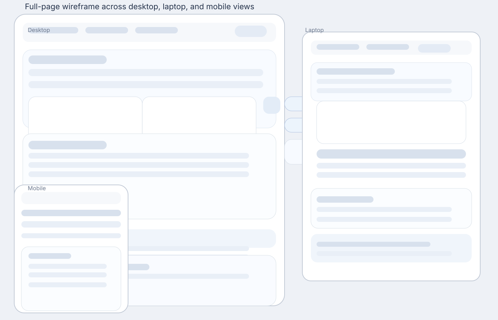

# Currency Converter 🌱
Convert currencies instantly using live exchange rates from around the world.

This currency converter allows you to quickly and accurately convert values between different currencies. Simply enter an amount, select your currencies, and get real-time results powered by an external API.
---
**View Site** → [Currency Converter]
(https://tech-stack-hub-lab.github.io/currency-converter/)

## 📚 Table of Contents

- [📌 Project Overview](#-project-overview)  
- [🎯 User Value](#-user-value)  
- [🚀 Features](#-features)  
- [🖥️ Technologies Used](#️-technologies-used)  
- [🎨 Front-End Design & Interactivity (LO1)](#-front-end-design--interactivity-lo1)    - [Colour Palette](#colour-palette)
        - [Typography](#typography)
        - [Wireframes](#wireframes)
- [✅ Testing & Validation (LO2)](#-testing--validation-lo2)  
- [☁️ Deployment & Version Control (LO3)](#️-deployment--version-control-lo3)  
- [📚 Documentation & Code Quality (LO4)](#-documentation--code-quality-lo4)  
- [⚙️ JavaScript Functionality (LO5)](#️-javascript-functionality-lo5)  
- [🤖 AI Usage & Reflection (LO6)](#-ai-usage--reflection-lo6)  
- [📦 Installation & Setup](#-installation--setup)  
- [🚀 Deployment Instructions](#-deployment-instructions)  
- [📸 Screenshots](#-screenshots)  
- [🔗 API Attribution](#-api-attribution)  
- [📁 Project Structure](#-project-structure)  
- [👤 User Stories](#-user-stories)  
- [🚀 Future Improvements](#-future-improvements)  

- [Lighthouse Performance](#lighthouse-performance)
---
# 📌 Project Overview
This project is a single-page web application (SPA) that allows users to convert currencies in real time. The application also integrates live weather data, provides interactive charts, and includes a dark/light theme toggle.
It is built using HTML, CSS, JavaScript, and external APIs, with a strong focus on user interaction, responsiveness, and accessibility.

# 🎯 User Value
The application provides users with:

Fast and accurate currency conversion
Real-time exchange rate updates
Local weather information based on location
A responsive and easy-to-use interface
Customisable dark/light mode for better usability

# 🚀 Features

✅ Currency conversion using live API data
✅ Weather display using geolocation
✅ Dark / Light theme toggle
✅ Exchange rate chart visualization (script.js)
✅ Currency swap functionality
✅ Dynamic dropdown population from JSON
✅ Currency cards with “Load More” feature
✅ Responsive design for all devices
✅ FAQ section with accordion UI

# 🖥️ Technologies Used

HTML5 – Semantic structure and layout
CSS3 – Styling, Flexbox, responsiveness
JavaScript (ES6) – Logic and interactivity
Bootstrap 5 – UI components and layout
Data visualization by using Chart
Font Awesome – Icons
APIs:

OpenWeather API (weather data)
Exchange Rate API (currency conversion)

LocalStorage – Save theme and chart history

# 🎨 Front-End Design & Interactivity (LO1)

Semantic HTML elements such as <header>, <nav>, <main>, <section>, and <footer> are used
Accessible navigation with descriptive labels and ARIA attributes
Clear UI with structured sections: converter, weather, about, FAQ
Responsive layout using Bootstrap grid and media queries
Interactive features:

Theme toggle using DOM manipulation
Dynamic weather dropdown
Currency conversion updates instantly

Chart dynamically updates using JavaScript
- [Design](#design)
  - [Colour Palette](#colour-palette)
  - [Typography](#typography)
  - [Wireframes](#wireframes)

# 📐 Wireframes
The following wireframe shows the full homepage layout for desktop, laptop, and mobile devices in one unified illustration.

This image is stored in `assets/images/wireframes` and depicts the complete page structure, including navigation, hero converter, chart, about section, currency cards, FAQ, and footer for each screen size.

# ✅ Testing & Validation (LO2)

HTML validated using W3C Validator
## assets/validation-result/html-validation.png
CSS validated using Jigsaw Validator
JavaScript tested to ensure:

No syntax errors
No console errors

All navigation links tested and working correctly

# ☁️ Deployment & Version Control (LO3)

Project deployed using a cloud hosting platform (e.g., GitHub Pages)
Live version matches development version
GitHub used for:

Version control
Commit history tracking

Code is clean with no unused or commented sections

# 📚 Documentation & Code Quality (LO4)

Code is separated into:

index.html
style.css
script.js

JavaScript is modular and organised into functions
Comments added for readability
Consistent naming conventions used
External APIs clearly referenced

# ⚙️ JavaScript Functionality (LO5)
## Theme Toggle

Uses localStorage to save user preference
Updates UI and icon dynamically

## Weather Feature

Uses geolocation API
Fetches weather data from OpenWeather API
Displays:

Location
Temperature
Condition

## Updates weather icon dynamically

Currency Converter

Fetches exchange rates using API
Handles:

Invalid input
Missing values

## Displays:

Converted value
Exchange rate
Last updated timestamp

## Chart Functionality

Built using Chart.js
Tracks exchange rate history
Stores data in localStorage
Displays trends for different time ranges

Currency Cards

Data loaded from JSON file
“Load More” button implemented using loop

Navigation

Smooth scrolling
Auto-collapse mobile navbar

##  🤖 AI Usage & Reflection (LO6)
AI Usage

Used for:

Code generation
Debugging issues
Improving UI/UX

## Reflection
AI tools helped speed up development and improved code quality. However, manual testing and understanding were essential to ensure correctness. AI acted as a support tool rather than replacing problem-solving skills.

## 📦 Installation & Setup

Clone repository:

Shellgit clone https://github.com/your-username/currency-converter.gitShow more lines

Open project:

Shellcd currency-converterShow more lines

Run:

Open index.html in browser
Or use Live Server (VS Code)

## 🚀 Deployment Instructions
GitHub Pages:

Push code to GitHub
Go to Settings > Pages
Select branch (main)
Save and get live URL

## 📸 Screenshots
(Add screenshots here)

Currency converter UI
Weather dropdown
Chart view
Dark / Light mode

## 🔗 API Attribution

Weather API: OpenWeatherMap
Currency API: ExchangeRate API

## 📁 Project Structure
currency-converter/
│
├── index.html
├── assets/
│   ├── css/style.css
│   ├── js/script.js
│   ├── images/
│   └── json/currency.json
└── README.md

## 👤 User Stories

As a user, I want to convert currency so that I can check exchange values
As a user, I want real-time rates so that results are accurate
As a user, I want to swap currencies quickly
As a user, I want a chart view to understand trends
As a user, I want weather updates for convenience
As a user, I want dark mode for better usability
As a mobile user, I want responsive design

## 🚀 Future Improvements

Add currency favourites
Improve chart with real historical API data
Add multi-language support
Enhance accessibility (keyboard navigation)
Add offline caching

### Screen Size Variation

- **Mobile** – compact navigation, stacked cards, and touch-friendly buttons.
- **Tablet** – balanced grid layout, visible charts, and responsive stepper controls.
- **Desktop** – full dashboard view with chart grid, export modal, and wider content panels.

## ✅ Accessibility & Responsiveness

- Uses semantic HTML and accessible button/label patterns.
- Includes `tabindex` support for keyboard navigation.
- Uses `loading="lazy"` for images to speed up page load.
- Applies responsive breakpoints for mobile, tablet, and desktop layouts.

## 🚦 Lighthouse Performance

- **Performance**: Optimized for fast interactions with lazy-loaded assets and minimal DOM overhead.
- **Accessibility**: Focuses on keyboard navigation, form labeling, and readable contrast.
- **Best Practices**: Uses modern HTML, avoids duplicate script loads, and leverages CDN resources.
- **SEO**: Includes meta descriptions, page titles, and meaningful content structure.

> Recommended: Run Chrome Lighthouse for exact scores and capture reports for mobile and desktop performance.

