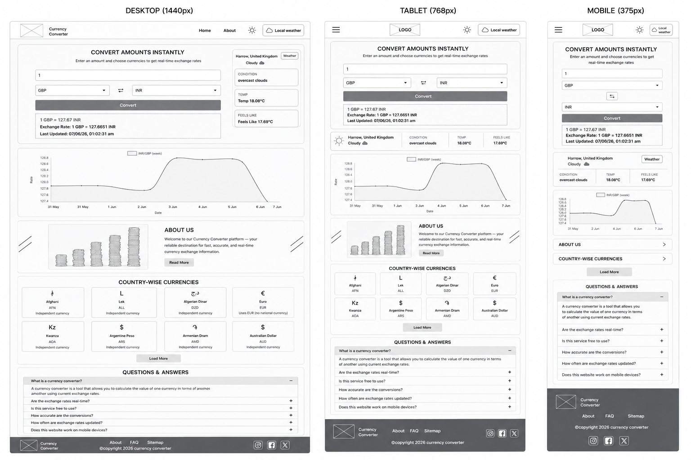
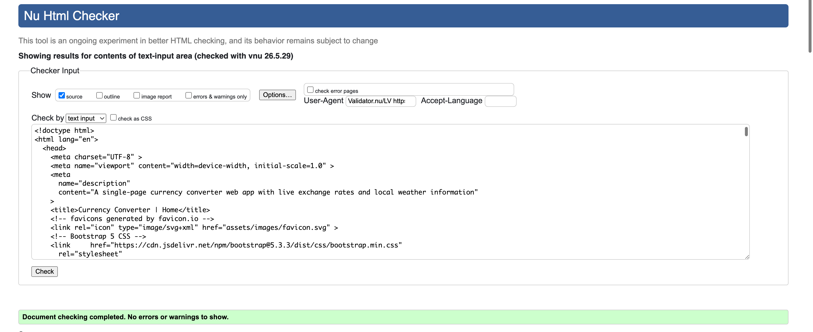
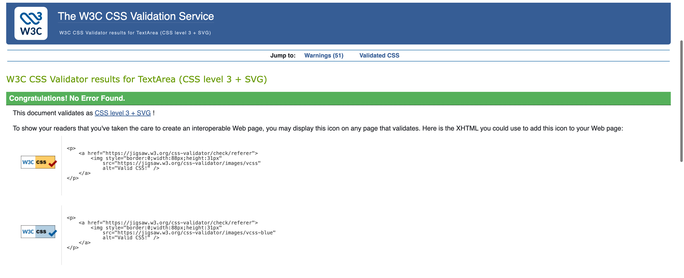
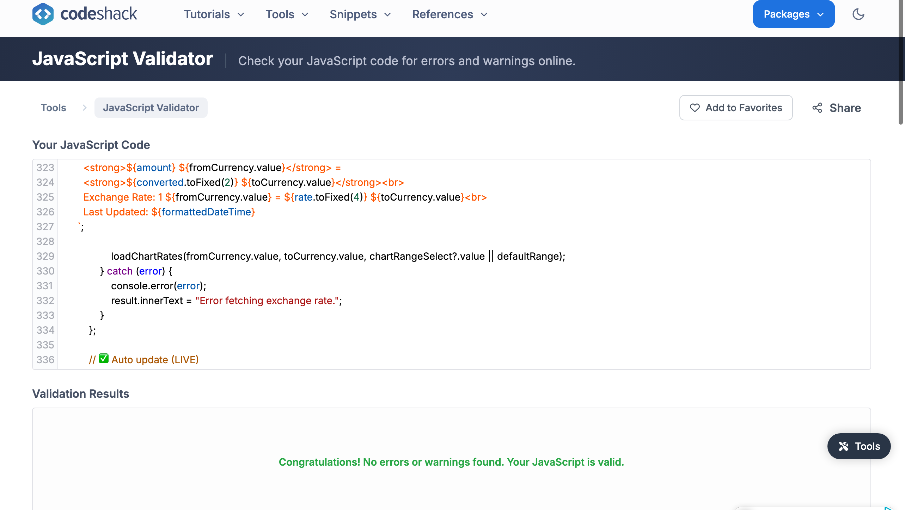

# Currency Converter 🌱
Convert currencies instantly with a responsive live exchange rate dashboard and local weather insights.

**View Site** → [Currency Converter](https://tech-stack-hub-lab.github.io/currency-converter/)


## 📚 Table of Contents

- [📌 Project Overview](#-project-overview)
- [🎯 User Stories](#-user-stories)
- [🚀 Features](#-features)
- [🖥️ Technologies Used](#️-technologies-used)
- [🎨 Front-End Design & Interactivity (LO1)](#-front-end-design--interactivity-lo1)
  - [Colour Palette](#colour-palette)
  - [Typography](#typography)
  - [Wireframes](#wireframes)
- [✅ Testing & Validation (LO2)](#-testing--validation-lo2)
- [☁️ Deployment & Version Control (LO3)](#️-deployment--version-control-lo3)
- [📚 Documentation & Code Quality (LO4)](#-documentation--code-quality-lo4)
- [⚙️ JavaScript Functionality (LO5)](#️-javascript-functionality-lo5)
- [🤖 AI Usage & Reflection (LO6)](#-ai-usage--reflection-lo6)
- [📦 Installation & Setup](#-installation--setup)
- [🚀 Deployment Instructions](#-deployment-instructions)
- [📸 Screenshots](#-screenshots)
- [🔗 API Attribution](#-api-attribution)
- [📁 Project Structure](#-project-structure)
- [👤 User Stories](#-user-stories)
- [🚀 Future Improvements](#-future-improvements)
- [Lighthouse Performance](#lighthouse-performance)

---

# 📌 Project Overview

Currency Converter is a responsive single-page web application built to convert currencies with real-time exchange data and weather context. The design focuses on clean layout, responsive behavior, and fast user interaction across desktop, tablet, and mobile.


## 🧾 User Stories

### 🌙 Theme Feature
- As a user, I want to toggle between dark and light mode so that I can use the app comfortably in different lighting conditions.
- As a returning user, I want my theme preference saved so that I don’t need to change it every time.

---

### 💱 Currency Converter
- As a user, I want to convert currencies in real time so that I can quickly check exchange values.
- As a user, I want to select different currencies so that I can convert between any countries.
- As a user, I want to see the conversion rate and last updated time so that I can trust the accuracy.

---

### 🔄 Swap Function
- As a user, I want to swap currencies instantly so that I can save time when reversing conversions.

---

### 📊 Chart Feature
- As a user, I want to see exchange rate trends in a chart so that I can understand currency changes over time.
- As a user, I want to change the time range (week/month/year) so that I can analyse trends easily.

---

### 🌦️ Weather Feature
- As a user, I want to see my local weather so that I can stay informed without leaving the app.
- As a user, I want clear weather icons and temperature so that the data is easy to understand.

---

### 📂 Currency List / Cards
- As a user, I want to browse available currencies so that I can learn about different world currencies.
- As a user, I want a “Load More” option so that the page stays clean and fast.

---

### ⚠️ Error Handling
- As a user, I want clear error messages when I enter invalid input so that I know how to fix it.
- As a user, I want the app to handle API errors smoothly so that it doesn’t crash.

---

### 📱 Responsiveness & Navigation
- As a mobile user, I want the app to work on my device so that I can use it anywhere.
- As a user, I want smooth navigation so that I can move between sections easily.


# 🚀 Features

- Live currency conversion and swap controls
- Weather panel with conditions, temperature, and feels-like data
- Responsive chart section for exchange trends
- Country currency overview cards
- About section with informative layout
- Expandable FAQ-style panels for user information
- Light/dark ready interface structure
- Clean navigation and accessible mobile menu behavior

# 🖥️ Technologies Used

- HTML5 for semantic structure
- CSS3 for responsive styling and layout
- JavaScript (ES6) for interactivity and API integration
- Bootstrap 5 for grid responsiveness and components
- Font Awesome for icons and UI markers
- Chart.js for trend visualization support
- OpenWeather API for weather data
- Exchange rate API for currency values
- LocalStorage for theme and state persistence

# 🎨 Front-End Design & Interactivity (LO1)

The UI emphasizes a modular dashboard with clear sections and responsive grouping.

## Colour Palette

**Dark mode**

| Role | Hex |
|------|-----|
| Background | `#000000` |
| Body text | `#ccffcc` |
| Glow accent | `#00ff00` |
| Player name / commands | `#00e5ff` |
| Weather / theme button | `#ffffff` |
| Game over / victory | `#ff2222` |
| Top bar border | `#333333` |

**Light mode**

| Role | Hex |
|------|-----|
| Background | `#f5f0e1` |
| Body text | `#1a1a1a` |
| Weather / theme button | `#8b0000` |
| Player name / commands | `#007700` |


## Typography

- Simple, readable text hierarchy
- Bold headings for section titles and UI labels
- Smaller body text for field and helper content
- Responsive typography sizing across breakpoints
The project uses one display family from [Google Fonts](https://fonts.google.com/), loaded in `index.html`.

## Wireframes

The wireframes show desktop, tablet, and mobile layout structure with the updated screenshot-style design.



These wireframes are stored in `assets/documents/wireframes` and reflect the key homepage sections: navigation, converter hero, weather panel, exchange chart, currency cards, about section, FAQ, and footer.

# ✅ Testing & Validation (LO2)

- HTML structure is built with semantic elements and validated for correctness

- CSS is structured for responsive rendering and minimal duplication

- JavaScript behavior is tested to ensure no syntax errors and proper form handling


# ☁️ Deployment & Version Control (LO3)

- Project is prepared for GitHub Pages deployment
- Source code is tracked using Git
- Commit history should reflect incremental updates and wireframe improvements
- Deployment can be published from the `main` or `gh-pages` branch for live hosting

# 📚 Documentation & Code Quality (LO4)

- Code organization separates `index.html`, `assets/css/style.css`, and `assets/js/script.js`
- Comments are used to document major sections and interactive behavior
- File paths are consistent and static assets are grouped clearly
- README contains an overview, feature summary, and setup instructions

# ⚙️ JavaScript Functionality (LO5)

## Theme Toggle

- Stores user color preference using `localStorage`
- Updates UI mode on page reload

## Weather Feature

- Uses browser geolocation to request local weather data
- Displays location, conditions, temperature, and feels-like values
- Includes a weather dropdown/toggle panel

## Currency Converter

- Fetches exchange rates from an external API
- Handles currency input and selection
- Supports swapping source and target currencies
- Displays converted output cleanly

## Chart Functionality

- Uses a chart canvas for exchange rate trend visualization
- Designed for dynamic updates and responsive layout
- Provides a visual timeline for rate changes across selections

## Country Cards

- Shows currency overview cards with simulated icon placeholders
- Supports responsive grid display for desktop, tablet, and mobile
- Enables a compact browse flow for common currency pairs

# 🤖 AI Usage & Reflection (LO6)

AI support was used to help generate wireframe visuals and polish documentation. The workflow combined automated asset generation with manual review to ensure the final README and UI design matched the requested screenshot style.

# 📦 Installation & Setup

Clone the repository:

```bash
git clone https://github.com/your-username/currency-converter.git
cd currency-converter
```

Open the project in a browser or use VS Code Live Server for local development.

# 🚀 Deployment Instructions

1. Push code to GitHub
2. Open repository settings
3. Select Pages
4. Choose the branch to deploy from (`main` or `gh-pages`)
5. Save and copy the generated live URL

# 📸 Screenshots

Use the wireframe images above for the updated responsive layout preview.

# 🔗 API Attribution

- OpenWeatherMap for weather data
- ExchangeRate API for currency conversion rates

# 📁 Project Structure


currency-converter/
├── index.html
├── assets/
│   ├── css/style.css
│   ├── js/script.js
│   ├── images/
│   ├── json/currency.json
│   
└── README.md


# 🚀 Future Improvements

- Add currency favorites and bookmarks
- Improve chart with real historical API data
- Add multi-language support
- Enhance accessibility and keyboard navigation
- Add offline caching for faster load times

# Lighthouse Performance

- Performance: optimized asset structure and minimal resource overhead
- Accessibility: semantic HTML, readable contrast, and keyboard-friendly controls
- Best Practices: modern resource loading via CDN and structured code
- SEO: meta descriptions, titles, and meaningful content hierarchy

> Recommended: run Chrome Lighthouse for exact desktop and mobile scores.

